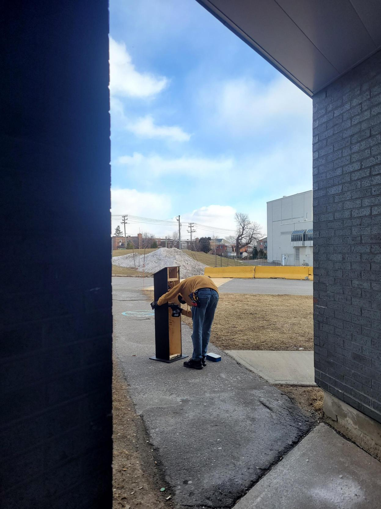

# Journal de création

* [Semaine 1](#semaine-1)
* [Semaine 2](#semaine-2)
* [Semaine 3](#semaine-3)
* [Semaine 4](#semaine-4)
* [Semaine 5](#semaine-5)
* [Semaine 6](#semaine-6)
* [Semaine de rattrapage](#semaine-de-rattrapage)
* [Semaine 7](#semaine-7)
* [Semaine 8](#semaine-8)

## Semaine 1
> Cette semaine a été parsemée de corrections et de réflexions.

Tout d’abord, comme prévu, nous avons scénarisé le projet dans le but de comprendre davantage ce qui se passe dans chaque chapitre autant au niveau sonore que visuel. Nous avons revu certains aspects de notre projet : intention, synopsis, moodboards visuel et sonore, schéma de plantation et de branchement, podium, liste de matériels et budget. Aussi, nous avons fait le devoir donné par Thomas ce jeudi à remettre le jeudi suivant, donc à la semaine 2.

Par la suite, nous avons visité les lieux de notre projet, soit le grand studio afin de déterminer le périmètre que nous voulons occuper au cours de la réalisation de notre projet et prendre des photos de celui-ci pour faire le schéma de plantation et veiller à ce qu'il soit le plus réaliste et le plus près de ce que nous imaginons. 

Enfin, nous avons également commencer à réfléchir et à créer une première esquisse présentant la direction artistique vers laquelle nous nous dirigeons pour le logo de notre projet.

À suivre.

## Semaine 2
> Cette semaine a été parsemée de réalisations et d'apprentissage.

Tout d’abord, comme prévu, nous avons chacun commencé à réaliser nos tâches attribuées personnellement nous poussant tous à apprendre l'utilisation de nouvelles choses : le logiciel TouchDesigner, des patchs VCV Rack ou du code dans Arduino. Nous avons pensé à l'esthétique exact de notre expérience pour qu'elle concorde autant au niveau sonore que visuel dans le but de former un tout. Aussi, nous avons fait le devoir donné par Thomas ce jeudi à remettre le jeudi suivant, donc à la semaine 3, en plus d'amener les corrections mentionnées pour le devoir 01.

Par la suite, nous avons récupéré notre matériel demandé pour commencer à faire certains tests tel que la projection d'un paysage visuel créé dans TouchDesigner. Nous avons également continué et finalisé la création du logo et de la bannière de Sonalux. 

Enfin, nous avons filmé la vidéo d'intention du projet et nous avons déterminé l'espace de notre installation en plaçant les deux murs mobiles avec en leur millieu le podium conçu. 

À suivre.

## Semaine 3
> Cette semaine a été parsemée de changements et de progressions.

Tout d'abord, comme prévu, plusieurs changements ont été apportés, notamment au synopsis et aux schémas. Nous avons également réalisé un storyboard nous menant vers une nouvelle esthétique qui respecte les paysages visuels choisis. Aussi, nous avons fait le devoir donné par Thomas ce jeudi à remettre le jeudi suivant, donc à la semaine 4, en plus d'amener les corrections mentionnées pour le devoir 02.

Par la suite, nous avons créé une interface virtuelle représentant l'interface physique que nous avons conçu. Divers aspects liés à la progression de l'installation ont été configurés. 

Enfin, nous avons commencé à installer les projecteurs et les haut-parleurs dans les herses. Malheureusement, donner la bonne position au projecteur s'est rélévée être plus difficile que ce que l'on pensait. 

À suivre.

## Semaine 4
> Cette semaine a été parsemée de difficultés et de modifications.  

Tout d'abord, comme prévu, nous avons poursuivi l'installation des projecteurs ainsi que des haut-parleurs. Ces derniers étaient positionnés trop hauts et le son était dirigé trop loin derrière le podium, donc nous avons dû les réinstallés pour les accrocher sur des pôles extensibles permettant qu'ils soient directement directionnés vers l'endroit où l'interacteur est amené à se placer. Plusieurs difficultés se sont présentés lors de l'installation des projecteurs, notamment la position donnée à chacun qui doit empêcher la formation d'une superposition entre les projections ou d'une ombre dessiné par les projecteurs sur la projection. Il y avait également la présence de barres blanches à faire disparaître. De plus, de nouvelles modifications ont été inclues.

> Vidéo courte démontrant l'installation des projecteurs.

Par la suite, nous avons officialisé notre logo et notre bannière suite aux commentaires reçus par Thomas et nous avons aussi modifié la vidéo d'intention pour s'assurer qu'elle soit à jour avec les changements que nous avons apportés au projet. 

Enfin, nous avons continué d'avancer sur la ligne du temps sur laquelle progresse l'expérience. 

> Vidéo courte démontrant l'avancement du projet. 

À suivre.

## Semaine 5
> Cette semaine a été parsemée d'analyse.

Tout d'abord, comme prévu, nous avons reçu la visite des étudiants et étudiantes de première année de TIM qui nous a permis d'avoir des rétrospectives sur notre projet et ainsi trouver des solutions sur les problèmes observés. Par exemple, nous avons remarqué que plusieurs ne regardent pas spécialement le visuel, car ils sont trop concentrés à écouter le son, ainsi nous avons décidé de les laisser expérimenter sans leur apposer aucune limite de temps pour qu'ils découvrent et prennent conscience graduellement de l'univers qu'il créé à leur rythme. 

> Vidéo courte démontrant la première visite des étudiants et étudiantes de première année en TIM.

Par la suite, nous avons décidé de remplacer la Kinect par les ToF Unit qui permettront l'activation de notre expérience par la détection de présence d'un interacteur. 

> Vidéo courte démontrant l'installation des atoms POE dans le podium dont celui relié aux ToF Unit. 

À suivre.

## Semaine 6
> Cette semaine a été parsemée de progrès. 

Tout d'abord, comme prévu, nous avons créé les deux nouveaux paysages visuels menant ainsi vers certaines modifications a apportées dans la préproduction. 

> Vidéo courte démontrant l'essai d'un nouveau paysage visuel génératif. 

Par la suite, nous avons continué à travailler sur le déroulement de la progression de la boucle.

Enfin, nous avons commencé la perforation des trous dans le podium.

> Vidéo courte démontrant la perforation des trous. 

À suivre.

## Semaine de rattrapage
> Cette semaine a été parsemée de finitions. 

Comme prévu, nous avons installé les crochets destinés aux casques d'écouteurs et nous avons finalisé le podium en plaçant les tubes DEL sur le devant de ce dernier, puis cachant avec du ruban adhésif noir, les ToF Unit situés devant également. 

> Vidéo courte démontrant l'installation des crochets sur le podium.

À suivre.

## Semaine 7
> Cette semaine a été parsemée de dernières finalités. 

Tout d'abord, comme prévu, nous avons déplacé le chariot portant l'ordinateur dans la salle des matrices et avons tout reconnecté nos fils à partir de cette salle de contrôle. 

> Vidéo courte démontrant le transfert de l'ordinateur dans la salle des matrices. 

Par la suite, nous avons fait imprimé et installé les pattes construites pour les tubes DEL posés au sol. 

> Vidéo courte démontrant l'imprimerie d'une des pattes des tubes DEL. 

Enfin, nous avons reçu à nouveau la visite des étudiants et étudiantes en première année de TIM dont nous avons profité de l'occasion pour filmer leurs interactions avec l'installation dans le but d'utiliser ces vidéos pour la vidéo de documentation. Nous avons également observé un problème avec les ToF Unit qui étaient trop sensibles ainsi cela faisait que les scènes changeaient constamment créant un effet d'instabilité à l'expérience. 

> Vidéo courte démontrant la deuxième visite des étudiants et étudiantes de première année en TIM.

## Semaine 8

