# Journal de création

## Semaine 1
> Cette semaine a été parsemée de corrections et de réflexions.

Tout d’abord, comme prévu, nous avons scénarisé le projet dans le but de comprendre davantage ce qui se passe dans chaque chapitre autant au niveau sonore que visuel. Nous avons revu certains aspects de notre projet : intention, synopsis, moodboards visuel et sonore, schéma de plantation et de branchement, podium, liste de matériels et budget. Aussi, nous avons fait le devoir donné par Thomas ce jeudi à remettre le jeudi suivant, donc à la semaine 2.

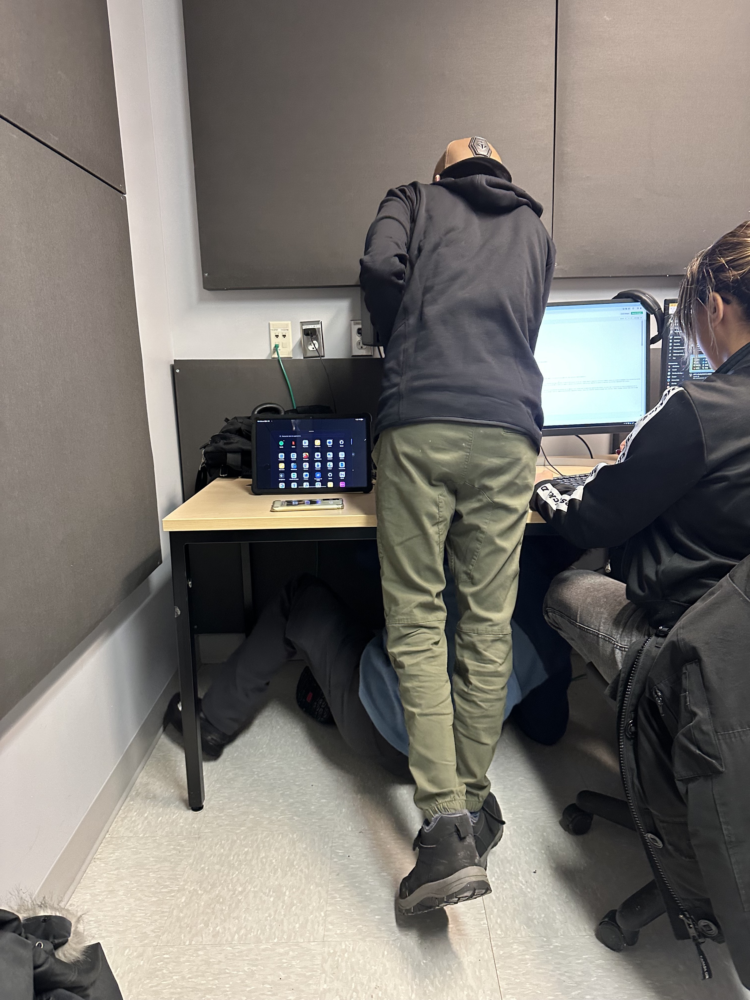

Par la suite, nous avons visité les lieux de notre projet, soit le grand studio afin de déterminer le périmètre que nous voulons occuper au cours de la réalisation de notre projet et prendre des photos de celui-ci pour faire le schéma de plantation et veiller à ce qu'il soit le plus réaliste et le plus près de ce que nous imaginons. 

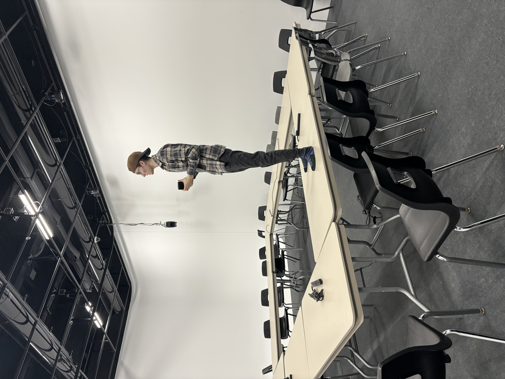

Enfin, nous avons également commencer à réfléchir et à créer une première esquisse présentant la direction artistique vers laquelle nous nous dirigeons pour le logo de notre projet.

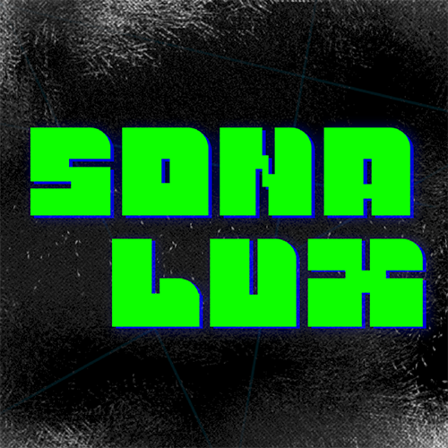

On a bien hâte de voir le projet se concrétiser davantage dans les lieux physiques. À suivre

## Semaine 2
> Cette semaine a été parsemée de réalisations et d'apprentissage.

Tout d’abord, comme prévu, nous avons chacun commencé à réaliser nos tâches attribuées personnellement nous poussant tous à apprendre l'utilisation de nouvelles choses : le logiciel TouchDesigner, des patchs VCV Rack ou du code dans Arduino. Nous avons pensé à l'esthétique exact de notre expérience pour qu'elle concorde autant au niveau sonore que visuel dans le but de former un tout. Aussi, nous avons fait le devoir donné par Thomas ce jeudi à remettre le jeudi suivant, donc à la semaine 3, en plus d'amener les corrections mentionnées pour le devoir 01.

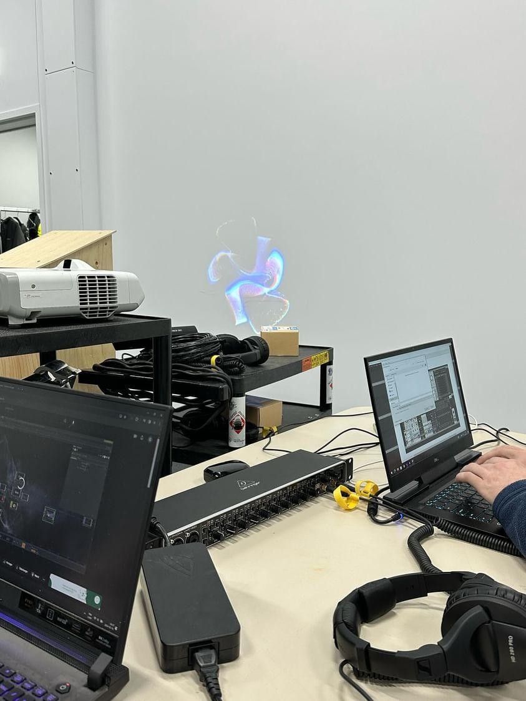

Par la suite, nous avons récupéré notre matériel demandé pour commencer à faire certains tests tel que la projection d'un paysage visuel créé dans TouchDesigner. Nous avons également continué et finalisé la création du logo et de la bannière de Sonalux. 

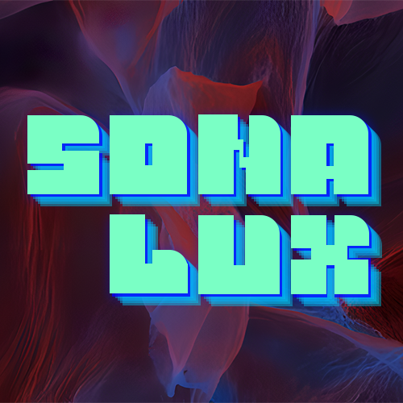

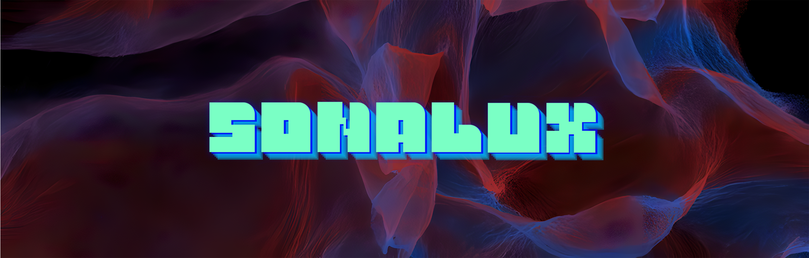

Enfin, nous avons filmé la vidéo d'intention du projet et nous avons déterminé l'espace de notre installation en plaçant les deux murs mobiles avec en leur millieu le podium conçu. 

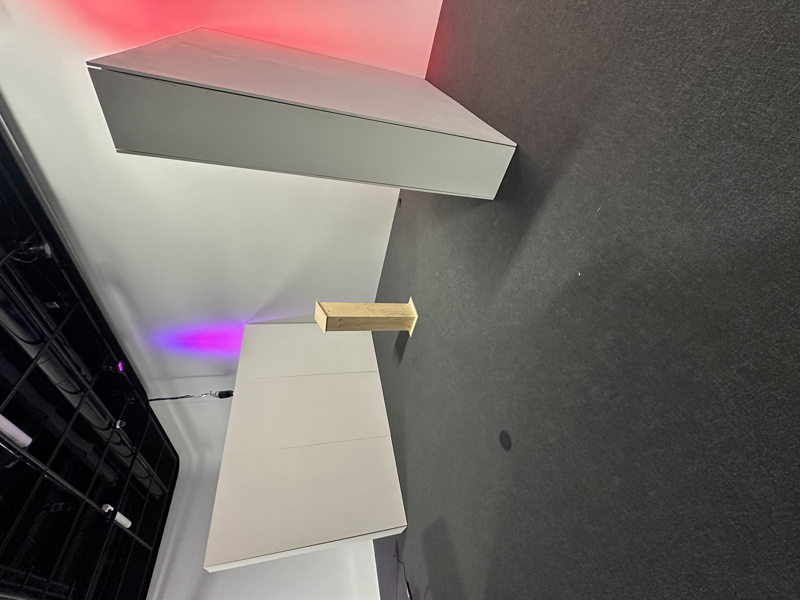

On a bien hâte de voir le projet se concrétiser davantage dans les lieux physiques. À suivre

## Semaine 3
> Cette semaine a été parsemée de changements et de progressions.

Tout d'abord, comme prévu, plusieurs changements ont été apportés, notamment au synopsis et aux schémas. Nous avons également réalisé un storyboard nous menant vers une nouvelle esthétique qui respecte les paysages visuels choisis. Aussi, nous avons fait le devoir donné par Thomas ce jeudi à remettre le jeudi suivant, donc à la semaine 4, en plus d'amener les corrections mentionnées pour le devoir 02.

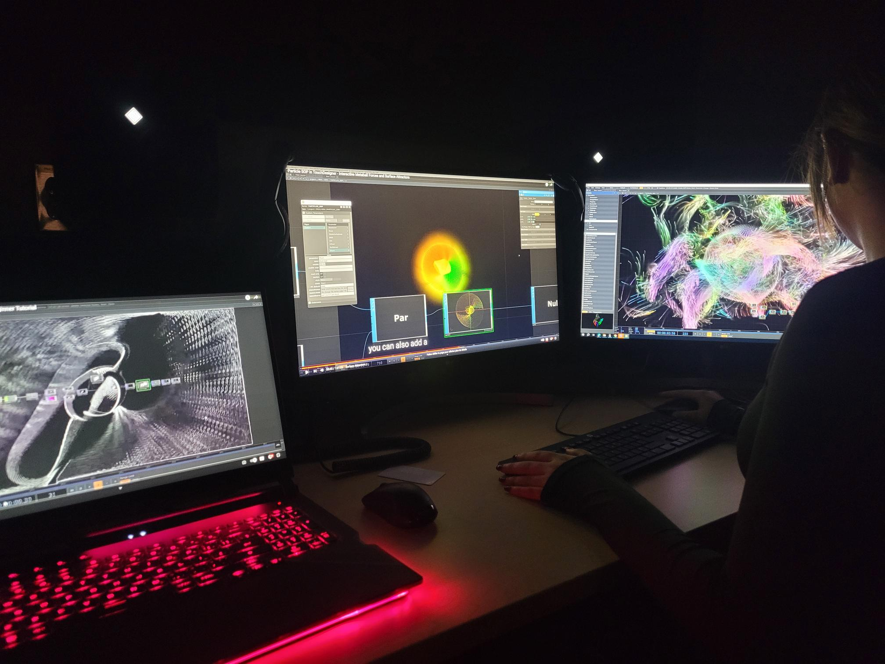

Par la suite, nous avons créé une interface virtuelle représentant l'interface physique que nous avons conçu. Divers aspects liés à la progression de l'installation ont été configurés. 

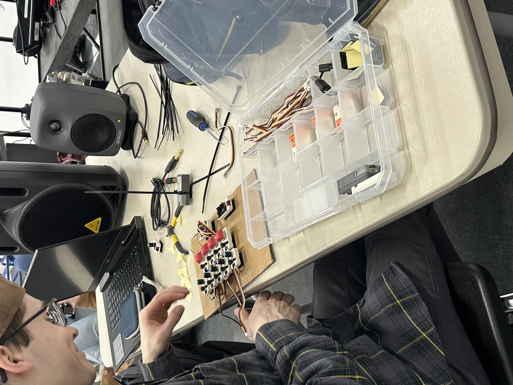

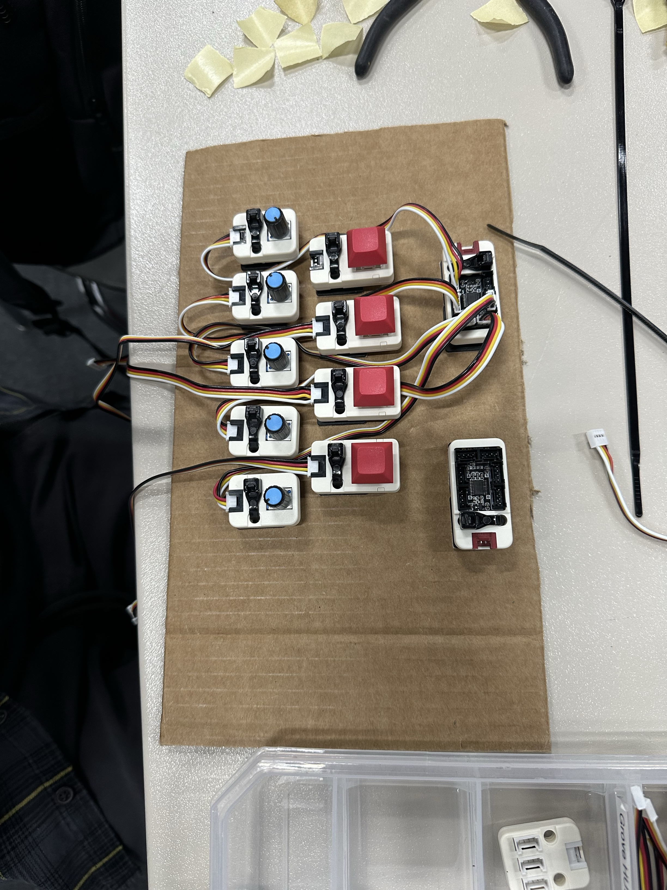

Enfin, nous avons commencé à installer les projecteurs et les haut-parleurs dans les herses. Malheureusement, donner la bonne position au projecteur s'est rélévée être plus difficile que ce que l'on pensait. 

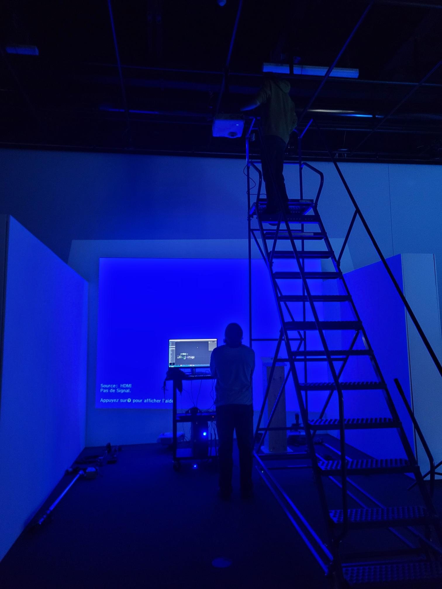

On a bien hâte de voir le projet se concrétiser davantage dans les lieux physiques. À suivre

## Semaine 4
> Cette semaine a été parsemée de difficultés et de modifications.  

Tout d'abord, comme prévu, nous avons poursuivi l'installation des projecteurs ainsi que des haut-parleurs. Ces derniers étaient positionnés trop hauts et le son était dirigé trop loin derrière le podium, donc nous avons dû les réinstallés pour les accrocher sur des pôles extensibles permettant qu'ils soient directement directionnés vers l'endroit où l'interacteur est amené à se placer. Plusieurs difficultés se sont présentés lors de l'installation des projecteurs, notamment la position donnée à chacun qui doit empêcher la formation d'une superposition entre les projections ou d'une ombre dessiné par les projecteurs sur la projection. Il y avait également la présence de barres blanches à faire disparaître. De plus, de nouvelles modifications ont été inclues.

[Vidéo de l'installation des projecteurs](medias/collectif/video_installation_projecteur_s4.mp4)

Par la suite, nous avons officialisé notre logo et notre bannière suite aux commentaires reçus par Thomas et nous avons aussi modifié la vidéo d'intention pour s'assurer qu'elle soit à jour avec les changements que nous avons apportés au projet. 

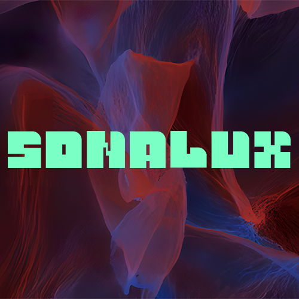

Enfin, nous avons continué d'avancer sur la ligne du temps sur laquelle progresse l'expérience. 

On a bien hâte de voir le projet se concrétiser davantage dans les lieux physiques. À suivre

## Semaine 5
> Contenu personnalisé à remplir par les équipes à chaque semaine faisant part du processus de création: résumé des réalisations d'équipe effectuées et des défis rencontrés sous forme d'un texte; ajout de vidéos, images, documents audios ou de contenu multimédia.)

## Semaine 6

## Semaine 7

## Semaine 8

