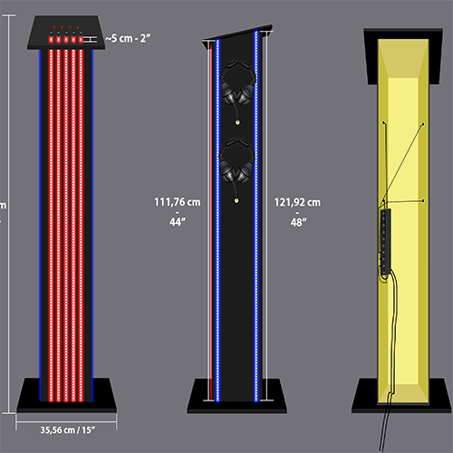

# Journal d'Antoine Haddad

* [Semaine 1](#semaine-1)
* [Semaine 2](#semaine-2)
* [Semaine 3](#semaine-3)
* [Semaine 4](#semaine-4)
* [Semaine 5](#semaine-5)
* [Semaine de rattrapage](#semaine-de-rattrapage)
* [Semaine 6](#semaine-6)
* [Semaine 7](#semaine-7)
* [Semaine 8](#semaine-8)
* [Semaine 9](#semaine-9)

## Semaine 1

### Résumé des réalisations effectuées
- Moodboard sonore
- Recréation du schéma de plantation
- Commencement du logo de projet
- Schéma et prototype du podium

### Image d'une réalisation dont tu es la ou le plus fier

### Est-ce que j'ai accompli l'ensemble des tâches et ou objectifs que je m'étais fixés pour cette semaine?	
- [X] Complètement
- [ ] Assez
- [ ] Peu
- [ ] Pas du tout

#### Décrivez pourquoi.
J'ai accompli l'ensemble de mes tâches dans les temps voulu.

### Mon projet s'est-il réalisé selon l’échéancier prévu?

- [X] Complètement
- [ ] Assez
- [ ] Un peu
- [ ] Pas tout à fait

### Défis pour la prochaine semaine
De demander à mon gérant pour l'utilisation du bois pour l'assemblage du podium. Si possible, assembler le podium.

---
## Semaine 2
### Résumé des réalisations effectuées
- Finalisation du logo du projet
- Création et finalisation de la bannière du projet
- Mesurer et couper du bois pour le podium
-  Assemblage du podium
-  Expérimentation avec Arduino

### Image d'une réalisation dont tu es la ou le plus fier

### Est-ce que j'ai accompli l'ensemble des tâches et objectifs que je m'étais fixés pour cette semaine?

- [X] Complètement
- [ ] Assez
- [ ] Peu
- [ ] Pas du tout

#### Décrivez pourquoi.
Cette semaine, j'ai eu beaucoup de motivation à travailler sur le projet parce qu'il s'agit de tâches que j'aime particulièrement faire.

### Mon projet s'est-il réalisé selon l’échéancier prévu?

- [X] Complètement
- [ ] Assez
- [ ] Un peu
- [ ] Pas tout à fait

### Défis pour la prochaine semaine
Me re-habituer à Arduino et l'utilisation du Atom5 et potentiellement réussi à coder les Unit Key comme un basculement (Toggle).

---
## Semaine 3 
### Résumé des réalisations effectuées
- Terminer la programmation des modules électroniques
- Créer un maquette pouvant tenir les modules électroniques de façon stable
- Modifier une dernière fois le logo et la bannière de l'équipe
- Commencer l'installation du projet
- Finalisation du schéma du podium

### Image d'une réalisation dont tu es la ou le plus fier

### Est-ce que j'ai accompli l'ensemble des tâches et objectifs que je m'étais fixés pour cette semaine?

- [ ] Complètement
- [X] Assez
- [ ] Peu
- [ ] Pas du tout

#### Décrivez pourquoi.
On a eu des complications au niveau de l'installation des projecteurs. L'angle du projecteur, sa hauteur et l'emplacement des barreaux et plafond ont provoqué des défauts sur le projections au mur.

#### S'il y a lieu, qu'allez-vous faire pour remédier à la situation?
Il va falloir changement le nombre de projecteurs attacher en hauteur. Nous pensons placer 2 des 4 projecteurs à terre afin de libérer de l'espace aux autres projecteurs. Nous pensons aussi à complètement retirer le 4e projecteur, celui qui projète au sol, du projet.

### Mon projet s'est-il réalisé selon l’échéancier prévu?

- [ ] Complètement
- [X] Assez
- [ ] Un peu
- [ ] Pas tout à fait

#### S'il y a des écarts, décrivez-les.
Étant donné des problème d'installations, nous allons passer plus de temps que prévu sur l'installation.

#### S'il y a lieu, qu'allez-vous faire pour remédier à la situation?
Nous allons nous rencontrer plus fréquemment hors cours pour poursuivre l'installation et rattrapper le temps perdu. 

### Défis pour la prochaine semaine
Confirmer avec Guillaume et Thomas des modification concerntant notre installation. Retravailler le schéma de plantation et discuté des bandes DEL.

---
## Semaine 4
### Résumé des réalisations effectuées
- Poursuite de l'installation du projet.
- Retravailler le schéma de plantation.
- Retravailler le schéma du podium.
- Ajouter le code aux Atom5 afin qu'ils puisse fonctionner par UDP.

### Image d'une réalisation dont tu es la ou le plus fier

### Est-ce que j'ai accompli l'ensemble des tâches et objectifs que je m'étais fixés pour cette semaine?

- [X] Complètement
- [ ] Assez
- [ ] Peu
- [ ] Pas du tout

### Mon projet s'est-il réalisé selon l’échéancier prévu?

- [ ] Complètement
- [X] Assez
- [ ] Un peu
- [ ] Pas tout à fait

#### S'il y a des écarts, décrivez-les.
 Normalement, c'était pas dans les temps voulu à cause de complication des projections sur les murs. 

#### S'il y a lieu, qu'allez-vous faire pour remédier à la situation?
Mais nous nous sommes rattrapé en temps voulu avec plus de rencontre hors cours.

### Défis pour la prochaine semaine
- Cacher les lumières blanches des projecteurs avec des morceaux de cartons.
- Percer le panneau au-dessus du podium afin d'installer les modules électroniques. 
---
## Semaine 5
### Résumé des réalisations effectuées
- Ajouté et coder le TOF Range sensor au poidum
- Perforer la plaquette du dessus du podium afin d'y ajouter les équipements électroniques
- Ajouter des morceaux de cartons sur les lentilles de chaque projecteurs afin de cachés la lumières blanches

### Image d'une réalisation dont tu es la ou le plus fier

[Avancement du podium - Youtube](https://www.youtube.com/watch?v=jYz8WghV8xQ&ab_channel=Antidote)

### Est-ce que j'ai accompli l'ensemble des tâches et objectifs que je m'étais fixés pour cette semaine?

- [X] Complètement
- [ ] Assez
- [ ] Peu
- [ ] Pas du tout

### Mon projet s'est-il réalisé selon l’échéancier prévu?

- [X] Complètement
- [ ] Assez
- [ ] Un peu
- [ ] Pas tout à fait

### Défis pour la prochaine semaine

- Assemblage du podium
- Installer la poignée et les pentures sur la planche arrière du podium
- Installer les Tubes DELs sur le podium
- Perforer les deux trous pour les deux TOF Range Sensor 
---
## Semaine de rattrapage
### Résumé des réalisations effectuées
- Installation des tubes DEL sur le podium
- Perforer 13 trous sur 15 sur le podium
- Installer les premières composantes à l'intérieur du podium
- Installer des vis plus adéquat pour les contrôleurs électronique

### Image d'une réalisation dont tu es la ou le plus fier

### Est-ce que j'ai accompli l'ensemble des tâches et objectifs que je m'étais fixés pour cette semaine?

- [X] Complètement
- [ ] Assez
- [ ] Peu
- [ ] Pas du tout

### Mon projet s'est-il réalisé selon l’échéancier prévu?

- [ ] Complètement
- [X] Assez
- [ ] Un peu
- [ ] Pas tout à fait

#### S'il y a des écarts, décrivez-les.
Malheursement, les crochets prévu afin de tenir les écouteurs étaient trop petites.

#### S'il y a lieu, qu'allez-vous faire pour remédier à la situation?
Nous devons en commander d'autre.

### Défis pour la prochaine semaine
Finalisation du projet
---
## Semaine 6
### Résumé des réalisations effectuées
- Installer les crochets pour les écouteurs
- Percer les trous pour les fils d'écouteurs
- Changer le code des Key unit afin d'avoir des couleurs qui correspond au projet
- Trouver les boutons pour les potentiomètre et les ajuster afin qui rentre sur les potentiomètres
- Changer la disposition des TOF range unit

### Image d'une réalisation dont tu es la ou le plus fier

### Est-ce que j'ai accompli l'ensemble des tâches et objectifs que je m'étais fixés pour cette semaine?

- [X] Complètement
- [ ] Assez
- [ ] Peu
- [ ] Pas du tout

### Mon projet s'est-il réalisé selon l’échéancier prévu?

- [X] Complètement
- [ ] Assez
- [ ] Un peu
- [ ] Pas tout à fait

### Défis pour la prochaine semaine
- Agrandir les trous de la plaquette du dessous afin qu'elle accueillir les nouveaux boutons des potentiomètre
- Installer le spotlight au-dessus du podium
---
## Semaine 7
### Résumé des réalisations effectuées
- Installation du spotlight
- Finalisation de la plaquette du podium

### Image d'une réalisation dont tu es la ou le plus fier

### Est-ce que j'ai accompli l'ensemble des tâches et objectifs que je m'étais fixés pour cette semaine?

- [X] Complètement
- [ ] Assez
- [ ] Peu
- [ ] Pas du tout

### Mon projet s'est-il réalisé selon l’échéancier prévu?

- [X] Complètement
- [ ] Assez
- [ ] Un peu
- [ ] Pas tout à fait

### Résultat attendu; très fier du projet!
