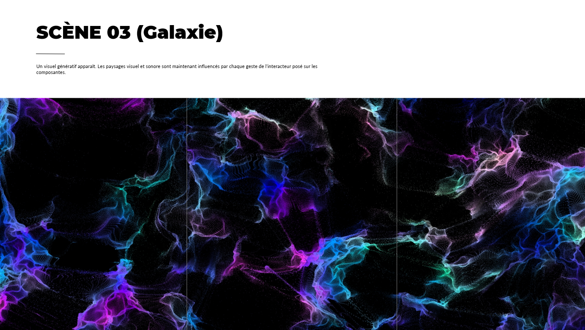

# Journal de Camélie Laprise

* [Semaine 1](#semaine-1)
* [Semaine 2](#semaine-2)
* [Semaine 3](#semaine-3)
* [Semaine 4](#semaine-4)
* [Semaine 5](#semaine-5)
* [Semaine 6](#semaine-6)
* [Semaine de rattrapage](#semaine-de-rattrapage)
* [Semaine 7](#semaine-7)
* [Semaine 8](#semaine-8)
* [Semaine 9](#semaine-9)

## Semaine 1

### Résumé des réalisations effectuées
- Retravailler l'intention. 
- Retravailler le synopsis. 
- Expliquer l'installation. 
- Refaire les moodboards. 
- Inclure les liens des vidéos de référence. 
- Faire le devoir de Thomas à remettre pour la semaine 2. 
- Revoir la liste de matériels.
- Revoir le budget.
- Arranger les erreurs dans la présentation de la préproduction. 

### Image d'une réalisation dont tu es la ou le plus fier

### Est-ce que j'ai accompli l'ensemble des tâches et objectifs que je m'étais fixés pour cette semaine?	
- [x] Complètement
- [ ] Assez
- [ ] Peu
- [ ] Pas du tout

#### Décrivez pourquoi.
Parce que j'ai terminé de réaliser l'ensemble des tâches qui m'étaient assignées dans le lapse de temps qui m'était donné, c'est-à-dire une semaine.   

#### S'il y a lieu, qu'allez-vous faire pour remédier à la situation?

### Mon projet s'est-il réalisé selon l’échéancier prévu?

- [x] Complètement
- [ ] Assez
- [ ] Un peu
- [ ] Pas tout à fait

#### S'il y a des écarts, décrivez-les.

#### S'il y a lieu, qu'allez-vous faire pour remédier à la situation?

### Défis pour la prochaine semaine
Apprendre et maîtriser le logiciel TouchDesigner. 

---
## Semaine 2
### Résumé des réalisations effectuées
- Produire les paysages visuels dans TouchDesigner.
- Faire le devoir de Thomas à remettre pour la semaine 3.
- Refaire les moodbards selon l'esthétique choisie.
- Retravailler la préproduction.
- Corriger le devoir 01 de Thomas.
- Remplir le journal collectif.

### Image d'une réalisation dont tu es la ou le plus fier

### Est-ce que j'ai accompli l'ensemble des tâches et objectifs que je m'étais fixés pour cette semaine?

- [x] Complètement
- [ ] Assez
- [ ] Peu
- [ ] Pas du tout

#### Décrivez pourquoi.
Parce que j'ai terminé de réaliser l'ensemble des tâches qui m'étaient assignées dans le lapse de temps qui m'était donné, c'est-à-dire une semaine.   

#### S'il y a lieu, qu'allez-vous faire pour remédier à la situation?

### Mon projet s'est-il réalisé selon l’échéancier prévu?

- [x] Complètement
- [ ] Assez
- [ ] Un peu
- [ ] Pas tout à fait

#### S'il y a des écarts, décrivez-les.

#### S'il y a lieu, qu'allez-vous faire pour remédier à la situation?

### Défis pour la prochaine semaine
Projeter trois projections au moyen de trois projecteurs sur les trois murs utilisés 

---
## Semaine 3 
### Résumé des réalisations effectuées
- Faire le storyboard.
- Trouver les images pour le moodboard général.
- Trouver la typographie.
- Remplir le journal collectif.
- Inclure les photos de chaque membre.

### Image d'une réalisation dont tu es la ou le plus fier

### Est-ce que j'ai accompli l'ensemble des tâches et objectifs que je m'étais fixés pour cette semaine?

- [ ] Complètement
- [x] Assez
- [ ] Peu
- [ ] Pas du tout

#### Décrivez pourquoi.
Parce que je n'ai pas pu projeter trois projections au moyen de trois projecteurs sur les trois murs utilisés dû aux problèmes rencontrés lors de l'installation des projecteurs.

#### S'il y a lieu, qu'allez-vous faire pour remédier à la situation?
Je vais retenter ce défi à la semaine 4, car d'ici là les projecteurs seront tous installés.

### Mon projet s'est-il réalisé selon l’échéancier prévu?

- [ ] Complètement
- [x] Assez
- [ ] Un peu
- [ ] Pas tout à fait

#### S'il y a des écarts, décrivez-les.
Nous n'avons pas réussi à installer l'ensemble des projecteurs. 

#### S'il y a lieu, qu'allez-vous faire pour remédier à la situation?
Nous allons finir l'installation des projecteurs pour la semaine 4.

### Défis pour la prochaine semaine
Lier chaque composante sur le podium à un paramètre dans le visuel de la scène 01.

---
## Semaine 4
### Résumé des réalisations effectuées
- Aider durant l'installation.
- Acheter le matériel nécessaire.
- Ajouter la typographie choisie dans le fichier TouchDesigner.
- Arranger la couverture.
- Monter la vidéo d'intention pour la mettre à jour.
- Lier les composantes à un paramètre du visuel de la scène 01. 
- Remplir le journal collectif. 

### Image d'une réalisation dont tu es la ou le plus fier

### Est-ce que j'ai accompli l'ensemble des tâches et objectifs que je m'étais fixés pour cette semaine?

- [x] Complètement
- [ ] Assez
- [ ] Peu
- [ ] Pas du tout

#### Décrivez pourquoi.
Parce que j'ai terminé de réaliser l'ensemble des tâches qui m'étaient assignées dans le lapse de temps qui m'était donné, c'est-à-dire une semaine.   

#### S'il y a lieu, qu'allez-vous faire pour remédier à la situation?

### Mon projet s'est-il réalisé selon l’échéancier prévu?

- [x] Complètement
- [ ] Assez
- [ ] Un peu
- [ ] Pas tout à fait

#### S'il y a des écarts, décrivez-les.

#### S'il y a lieu, qu'allez-vous faire pour remédier à la situation?

### Défis pour la prochaine semaine
Commencer à peinturer le podium.

---
## Semaine 5
### Résumé des réalisations effectuées
- Lier les composantes à un paramètre visuel de la scène 02.
- Peinturer le podium.
- Remplir le journal collectif.

### Image d'une réalisation dont tu es la ou le plus fier

> Vidéo démontrant l'application de peinture noire sur le podium. 

### Est-ce que j'ai accompli l'ensemble des tâches et objectifs que je m'étais fixés pour cette semaine?

- [x] Complètement
- [ ] Assez
- [ ] Peu
- [ ] Pas du tout

#### Décrivez pourquoi.
Parce que j'ai terminé de réaliser l'ensemble des tâches qui m'étaient assignées dans le lapse de temps qui m'était donné, c'est-à-dire une semaine.   

#### S'il y a lieu, qu'allez-vous faire pour remédier à la situation?

### Mon projet s'est-il réalisé selon l’échéancier prévu?

- [x] Complètement
- [ ] Assez
- [ ] Un peu
- [ ] Pas tout à fait

#### S'il y a des écarts, décrivez-les.

#### S'il y a lieu, qu'allez-vous faire pour remédier à la situation?

### Défis pour la prochaine semaine
Commencer à organiser et à ranger l'espace en fonction de la semaine d'expositions.

---
## Semaine 6
### Résumé des réalisations effectuées
- Refaire le storyboard.
- Faire le budget.
- Retravailler la préproduction.
- Commander le matériel nécessaire. 
- Aider lors du perçage des trous dans le podium.
- Commencer à ranger l'espace. 
- Remplir le journal collectif.

### Image d'une réalisation dont tu es la ou le plus fier

### Est-ce que j'ai accompli l'ensemble des tâches et objectifs que je m'étais fixés pour cette semaine?

- [x] Complètement
- [ ] Assez
- [ ] Peu
- [ ] Pas du tout

#### Décrivez pourquoi.
Parce que j'ai terminé de réaliser l'ensemble des tâches qui m'étaient assignées dans le lapse de temps qui m'était donné, c'est-à-dire une semaine.  

#### S'il y a lieu, qu'allez-vous faire pour remédier à la situation?

### Mon projet s'est-il réalisé selon l’échéancier prévu?

- [ ] Complètement
- [x] Assez
- [ ] Un peu
- [ ] Pas tout à fait

#### S'il y a des écarts, décrivez-les.
Les crochets que nous avions étaient trop petits pour les casques d'écouteurs ainsi nous en avons commandé d'autres et ne pouvons pas faire les trous cette semaine.

#### S'il y a lieu, qu'allez-vous faire pour remédier à la situation?
Nous allons faire les trous pour ces nouveaux crochets durant la semaine de rattrapage.

### Défis pour la prochaine semaine
Placer les tubes DEL. 

---
## Semaine de rattrapage
### Résumé des réalisations effectuées
- Placer les tubes DEL.
- Mettre du ruban adhésif noir pour cacher les fils.
- Cacher les ToF Unit avec du ruban adhésif noir.
- Remplir le journal collectif. 

### Image d'une réalisation dont tu es la ou le plus fier

> Vidéo démontrant l'ajout de ruban adhésif sur les tubes DEL.

### Est-ce que j'ai accompli l'ensemble des tâches et objectifs que je m'étais fixés pour cette semaine?

- [x] Complètement
- [ ] Assez
- [ ] Peu
- [ ] Pas du tout

#### Décrivez pourquoi.
Parce que j'ai terminé de réaliser l'ensemble des tâches qui m'étaient assignées dans le lapse de temps qui m'était donné, c'est-à-dire une semaine. 

#### S'il y a lieu, qu'allez-vous faire pour remédier à la situation?

### Mon projet s'est-il réalisé selon l’échéancier prévu?

- [x] Complètement
- [ ] Assez
- [ ] Un peu
- [ ] Pas tout à fait

#### S'il y a des écarts, décrivez-les.

#### S'il y a lieu, qu'allez-vous faire pour remédier à la situation?

### Défis pour la prochaine semaine
Compléter le projet. 

---
## Semaine 7
### Résumé des réalisations effectuées
- Peinturer les vis sur le podium en noir.
- Faire la carte du bloc C au 1ère étage du collège pour le comité Signalétique.
- Prendre des vidéos de l'installation et lors des visites pour les deux vidéos.
- Monter la vidéo courte.
- Remplir le journal collectif. 

### Image d'une réalisation dont tu es la ou le plus fier

### Est-ce que j'ai accompli l'ensemble des tâches et objectifs que je m'étais fixés pour cette semaine?

- [ ] Complètement
- [ ] Assez
- [ ] Peu
- [ ] Pas du tout

#### Décrivez pourquoi.
 

#### S'il y a lieu, qu'allez-vous faire pour remédier à la situation?

### Mon projet s'est-il réalisé selon l’échéancier prévu?

- [ ] Complètement
- [ ] Assez
- [ ] Un peu
- [ ] Pas tout à fait

#### S'il y a des écarts, décrivez-les.

#### S'il y a lieu, qu'allez-vous faire pour remédier à la situation?

### Défis pour la prochaine semaine

## Semaine 8

## Semaine 9
