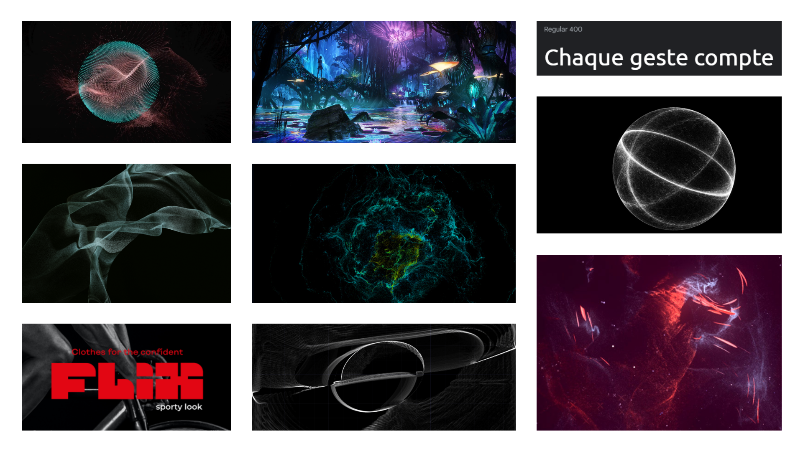
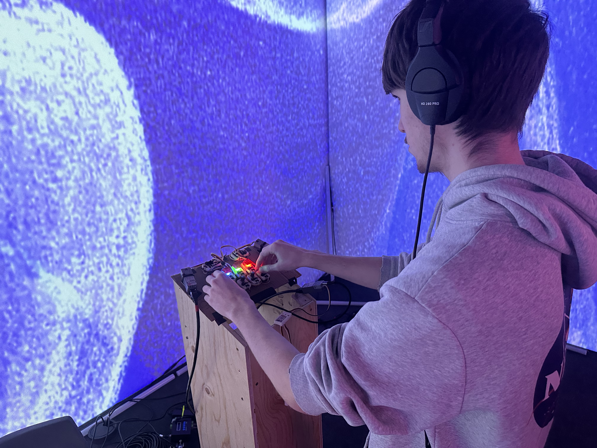
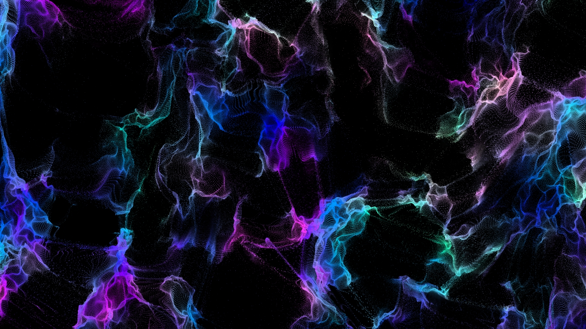
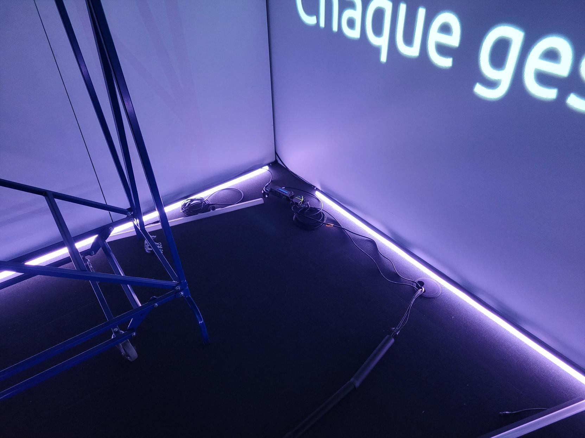
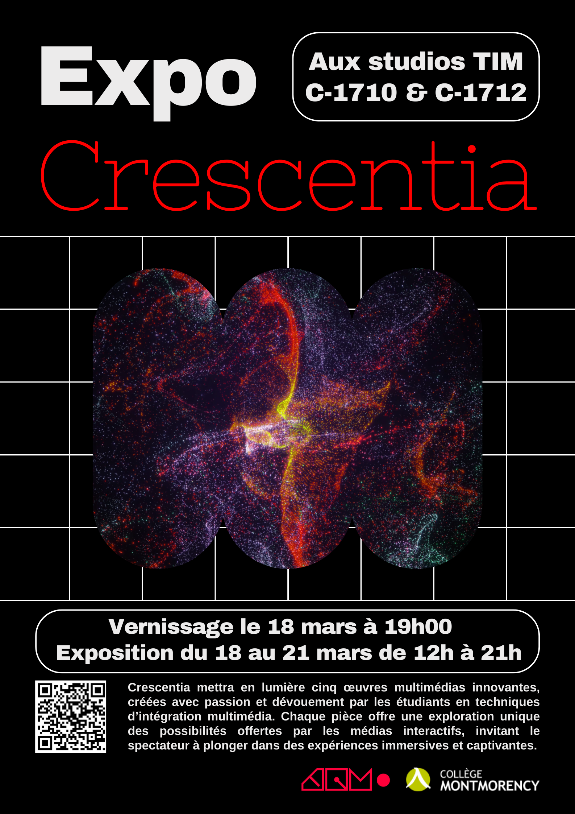

# Journal de Ghita Alaoui

* [Semaine 1](#semaine-1)
* [Semaine 2](#semaine-2)
* [Semaine 3](#semaine-3)
* [Semaine 4](#semaine-4)
* [Semaine 5](#semaine-5)
* [Semaine 6](#semaine-6)
* [Semaine de rattrapage](#semaine-de-rattrapage)
* [Semaine 7](#semaine-7)
* [Semaine 8](#semaine-8)
* [Semaine 9](#semaine-9)

## Semaine 1

### Résumé des réalisations effectuées

- Améliorer l'intention du projet
- Clarifier le synopsis
- Expliquer l'installation et les différentes composantes de la boite
- Scénariser les différents chapitres à l'aide de moodboards 
- Compléter le devoir de Thomas 
- Arranger les erreurs dans la présentation de la préproduction
- Découvrir l'utilisation de TouchDesigner

### Image d'une réalisation dont tu es la plus fière

### Est-ce que j'ai accompli l'ensemble des tâches et objectifs que je m'étais fixés pour cette semaine?	

- [x] Complètement
- [ ] Assez
- [ ] Peu
- [ ] Pas du tout

#### Décrivez pourquoi.

Parce que j'ai complété l'ensemble des tâches qui m'était assignées et me suis organisée pour la semaine prochaine.

### Mon projet s'est-il réalisé selon l’échéancier prévu?

- [x] Complètement
- [ ] Assez
- [ ] Un peu
- [ ] Pas tout à fait

### Défis pour la prochaine semaine

Le principal défi pour la semaine prochaine est de continuer à utiliser le logiciel TouchDesigner et m'améliorer.

---
## Semaine 2

### Résumé des réalisations effectuées

- Réalisation d'un paysage test visuel sur TouchDesigner
- Correction de la préproduction sur GitHub
- Réaliser le devoir de Thomas pour la semaine 3
- Retravailler le travail 2 de Thomas
- Refaire le moodboard visuel pour ajuster l'ambiance général
  
### Image d'une réalisation dont tu es la plus fière

### Est-ce que j'ai accompli l'ensemble des tâches et objectifs que je m'étais fixés pour cette semaine?

- [x] Complètement
- [ ] Assez
- [ ] Peu
- [ ] Pas du tout

#### Décrivez pourquoi.

Parce que j'ai complété l'ensemble des tâches qui m'était assignées. De plus, je me suis familiarisé avec le logiciel de TouchDesigner.

### Mon projet s'est-il réalisé selon l’échéancier prévu?

- [x] Complètement
- [ ] Assez
- [ ] Un peu
- [ ] Pas tout à fait

### Défis pour la prochaine semaine

Le principal défi de la semaine prochaine est de commencer à réfléchir au mapping des 3 projections sur le mur ainsi que celle sur le sol.

---
## Semaine 3 

### Résumé des réalisations effectuées

- Réalisation du paysage principal de l'expérience
- Réalisation du paysage visuel du sol
- Mettre à jour la préproduction
- Mettre à jour les devoirs artistiques pour le cours de Thomas

### Image d'une réalisation dont tu es la plus fière

### Est-ce que j'ai accompli l'ensemble des tâches et objectifs que je m'étais fixés pour cette semaine?

- [x] Complètement
- [ ] Assez
- [ ] Peu
- [ ] Pas du tout

#### Décrivez pourquoi.

Parce que j'ai complété l'ensemble des tâches qui m'était assignées. De plus, j'ai sû réaliser les paysages visuels que nous allons utiliser.
 
### Mon projet s'est-il réalisé selon l’échéancier prévu?

- [x] Complètement
- [ ] Assez
- [ ] Un peu
- [ ] Pas tout à fait

### Défis pour la prochaine semaine

Le principal défi pour la semaine prochaine sera d'essayer de faire un rendu 3 caméras pour le visuel.

---
## Semaine 4

### Résumé des réalisations effectuées

- Refaire le moodboard visuel pour le mettre en lien avec la nouvelle ambiance
- Retravailler le powerpoint pour la vidéo d'intention
- Refilmer la vidéo d'intention
- Aider à monter l'installation

### Image d'une réalisation dont tu es la plus fière

### Est-ce que j'ai accompli l'ensemble des tâches et objectifs que je m'étais fixés pour cette semaine?

- [X] Complètement
- [ ] Assez
- [ ] Peu
- [ ] Pas du tout

#### Décrivez pourquoi.

J'ai réussi l'ensemble de mes tâches, mais en a fait moins que les semaines dernières étant donné que cette semaine était moins occupée que les précédentes.

### Mon projet s'est-il réalisé selon l’échéancier prévu?

- [X] Complètement
- [ ] Assez
- [ ] Un peu
- [ ] Pas tout à fait

### Défis pour la prochaine semaine

Le principal défi sera de créer les différents liens entre le visuel et les différentes composantes tactiles. De plus, il va falloir trouver un moyen d'incorporer correctement le visuel sur les trois murs.

---
## Semaine 5

### Résumé des réalisations effectuées

- Aider à travailler sur le lien entre les visuels et les composantes tactiles
- Aider à monter l'installation
- Accueillir les élèves de première année
- Remplir le sondage pour l'évaluation du travail d'équipe

### Image d'une réalisation dont tu es la plus fière

### Est-ce que j'ai accompli l'ensemble des tâches et objectifs que je m'étais fixés pour cette semaine?

- [ ] Complètement
- [X] Assez
- [ ] Peu
- [ ] Pas du tout

#### Décrivez pourquoi 

J'ai réussi l'ensemble de mes tâches, mais en a fait moins que les semaines dernières étant donné que cette semaine était moins occupée que les précédentes.

### Mon projet s'est-il réalisé selon l’échéancier prévu?

- [X] Complètement
- [ ] Assez
- [ ] Un peu
- [ ] Pas tout à fait

### Défis pour la prochaine semaine

Le principal défi pour la semaine prochaine sera de commencer à cacher les fils de l'installation.

---

## Semaine 6
### Résumé des réalisations effectuées

- Création du deuxième paysage visuel 
- Création du troisième paysage visuel
- Lier les composantes du deuxième et troisième paysage visuel
- Aider pour l'installation
- Aider pour le podium

### Image d'une réalisation dont tu es la plus fière

### Est-ce que j'ai accompli l'ensemble des tâches et objectifs que je m'étais fixés pour cette semaine?

- [X] Complètement
- [ ] Assez
- [ ] Peu
- [ ] Pas du tout

#### Décrivez pourquoi.

Parce que j'ai complété l'ensemble des tâches qui m'était assignées. De plus, je me suis familiarisé encore plus avec l'interface virtuelle.
 
### Mon projet s'est-il réalisé selon l’échéancier prévu?

- [X] Complètement
- [ ] Assez
- [ ] Un peu
- [ ] Pas tout à fait

### Défis pour la prochaine semaine

Le principal défi pour la semaine prochaine sera d'essayer de placer les tubes DEL correctement dans l'espace.

---

## Semaine de rattrapage

### Résumé des réalisations effectuées

- Placer les lumières DEL sur le sol et les brancher
- Cacher les branchements avec du tape
- Cacher la lumière des DEL avec du tape
- Aider avec le podium

### Image d'une réalisation dont tu es la ou le plus fier

> Vidéo de l'installation des DEL 

> Résultat :

### Est-ce que j'ai accompli l'ensemble des tâches et objectifs que je m'étais fixés pour cette semaine?

- [x] Complètement
- [ ] Assez
- [ ] Peu
- [ ] Pas du tout

#### Décrivez pourquoi.

Parce que j'ai complété l'ensemble des tâches qui m'était assignées avec une bonne échéance.

### Mon projet s'est-il réalisé selon l’échéancier prévu?

- [x] Complètement
- [ ] Assez
- [ ] Un peu
- [ ] Pas tout à fait

### Défis pour la prochaine semaine

Le principal défi sera de finaliser l'installation.

---
## Semaine 7

### Résumé des réalisations effectuées

- Peinturer les vis du podium
- M'occuper du comité communication (courriel, publicité, affiches, etc.)
- Prendre des vidéos de l'installation et lors des visites pour les deux vidéos.

### Image d'une réalisation dont tu es la plus fière

### Est-ce que j'ai accompli l'ensemble des tâches et objectifs que je m'étais fixés pour cette semaine?

- [x] Complètement
- [ ] Assez
- [ ] Peu
- [ ] Pas du tout

#### Décrivez pourquoi.

Parce que j'ai complété l'ensemble des tâches qui m'était assignées avec une bonne échéance. 

### Mon projet s'est-il réalisé selon l’échéancier prévu?

- [x] Complètement
- [ ] Assez
- [ ] Un peu
- [ ] Pas tout à fait

### Défis pour la prochaine semaine
Le principal défi pour la semaine prochaine sera de s'assurer que l'installation roule tout le temps sans bugs.

## Semaine 8

### Résumé des réalisations effectuées

- Être présente à l'exposition et au vernissage.
