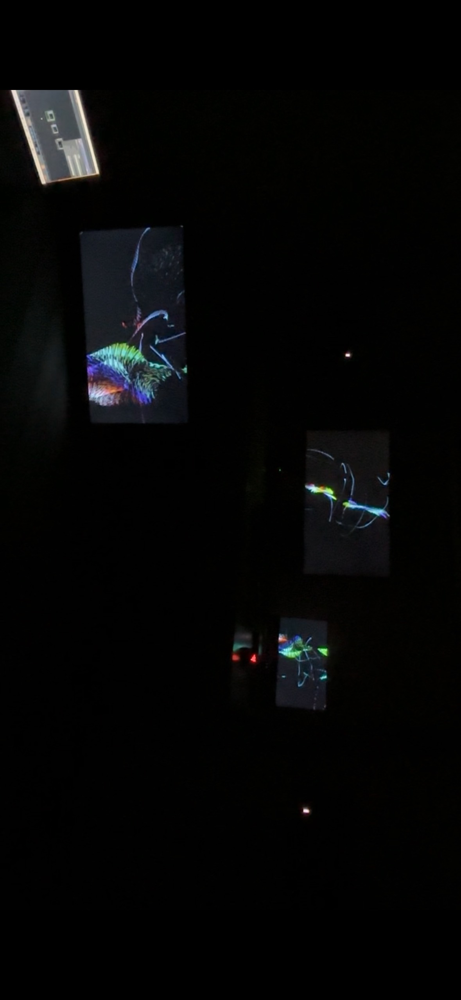
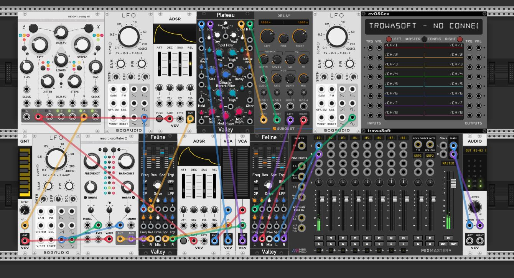
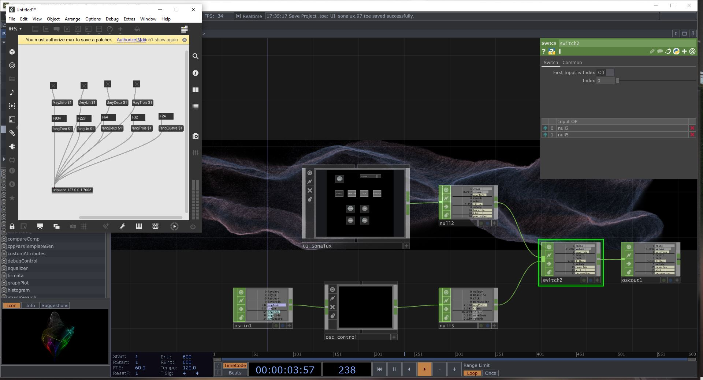
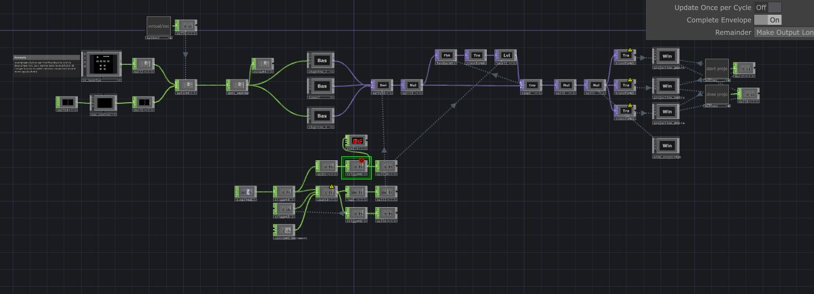
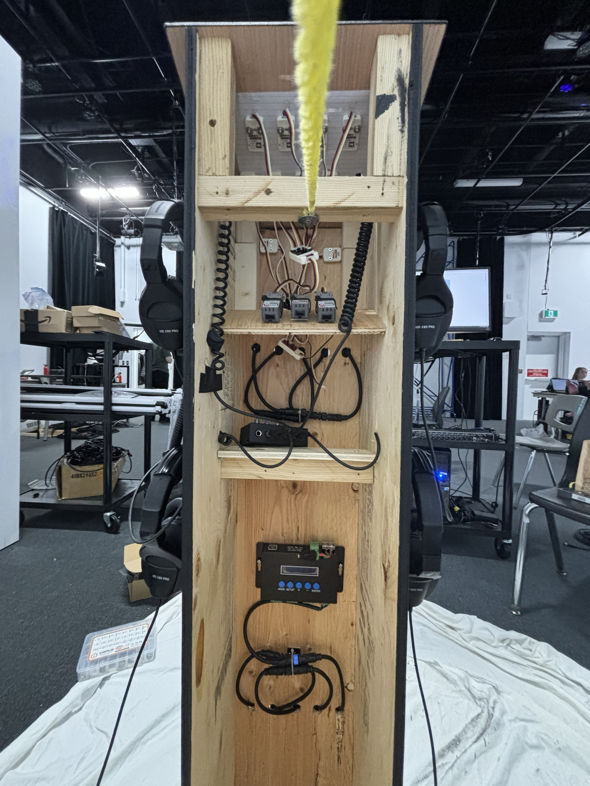

# Journal de Vincent Desjardins

* [Semaine 1](#semaine-1)
* [Semaine 2](#semaine-2)
* [Semaine 3](#semaine-3)
* [Semaine 4](#semaine-4)
* [Semaine 5](#semaine-5)
* [Semaine de rattrapage](#semaine-de-rattrapage)
* [Semaine 6](#semaine-6)
* [Semaine 7](#semaine-7)
* [Semaine 8](#semaine-8)
* [Semaine 9](#semaine-9)

## Semaine 1

### Résumé des réalisations effectuées
- clarifier les intentions et l'émergence de la riaosn du projet
- creation du schéma de branchement pour l'instalation
- création du schema de branchement pour le module interactif(la boite)
- test pour pour sortir 4 flux videos avec touchdesigner dont 2 par NDI et les envoyer sur un autre ordinateurs

### Image d'une réalisation dont tu es la ou le plus fier

### Est-ce que j'ai accompli l'ensemble des tâches et objectifs que je m'étais fixés pour cette semaine?	
- [x] Complètement
- [ ] Assez
- [ ] Peu
- [ ] Pas du tout

#### Décrivez pourquoi.
Nous avons completer le document de préprod ce qui nous permetra de bien séparer tout les taches du projets et permettre de se faire un horraire et se mettre des objectifs clairs et précis

### Mon projet s'est-il réalisé selon l’échéancier prévu?

- [x] Complètement
- [ ] Assez
- [ ] Un peu
- [ ] Pas tout à fait

### Défis pour la prochaine semaine
montrer aux autres membres de l'équipe le fonctionnement de touchdesigner. Avancer, voir meme avoir fini un module sonore dans Vcv rack pour avoir un début d'expérience en parralele avec un visuel

---
## Semaine 2
### Résumé des réalisations effectuées
- enseigner à Camélie TouchDesigner pour pas que l'équipe soit dépendante de moi tout au long du projet.
- ajustement des schéma de branchement suite aux rencontres avec les profs
- commencer la creation du module sonore "génératif" dans Vcv rack
- trouver une identité visuelle générative dans touch designer
- repenser le schéma de l'interacteur du projet

### Image d'une réalisation dont tu es la ou le plus fier

### Est-ce que j'ai accompli l'ensemble des tâches et objectifs que je m'étais fixés pour cette semaine?

- [ ] Complètement
- [x] Assez
- [ ] Peu
- [ ] Pas du tout

#### Décrivez pourquoi.
 j'ai réaliser un module de son génératif qui fonctionne très bien et va pouvoir etre facilement adaptable pour intégrer les controle provenant de notre module interactif physique, mais je trouve que le son qu'il produit n'est pas encore excactement ce a quoi nous voulons que sa sonne, donc c'est pourquoi je me done la note de "assez", car c'est une très bonne base et maintenant il reste juste a expérimenter avec les différents sons a générer.
 Aussi j'ai pu prendre une demi-journée avec Camélie pour m'assoir avec elle et lui montrer les bases de Touchdesigner et l'accompagner dans ses premier balbutiment dans le logiciel.

### Mon projet s'est-il réalisé selon l’échéancier prévu?

- [x] Complètement
- [ ] Assez
- [ ] Un peu
- [ ] Pas tout à fait
- [ ] 
### Défis pour la prochaine semaine
puisque que Vcv rack est compatible avec Cardinal(une version open source et gratuite de Vcv) j'ai réussi à intégrer Cardinal dans TouchDesigner et le faire runner comme un vst audio a l'intérieur même du projet touch.
Ce qui pourrait rendre le projet plus simple a "allumer", car nous aurions seulement a ouvrir le projet touch et le projet serait prêt rouler. Donc pas besoin d'ouvrir plusieurs logiciel et faire la communication entre chacun.
Par contre le défi est que maintenant je suis seulement capable de sortir de l'audio quand cardinal est dans touch comme Vst, mais je dois trouver comment je peut aussi lui envoyer de l'information (par example du Midi).
un autre défi auquel je n'est pas encore fait face est de trouver une liscence touchdesigenr,car nous avons fait des test avec une projetion et la qualité est correct sans plus ni moin, mais j'aimerai vraiment pouvoir output du visuel plus sharp et de haute qualitée
---
## Semaine 3 
### Résumé des réalisations effectuées
J'ai créer une interface virtuel de notre futur interface physique. elle nous permet maintenant de pouvoir construire notre code et ne pas avancer dans le vide.
Elle permet de controler toute l'instalation de plus elle peut aussi etre contrôler par de l'osc donc le tout est prêt a intégrer nos micros controleurs.
Sur la capture d'écran on peut voir max, car j'ai simuler des message osc, car je n'avais pas encore le micro controleurs en mains donc c'étais une solution rapide et efficace pour la programmation dans max et vcv.
Ensuite, j'ai créé un patch touchdesigner qui englobe le projet au complet, donc gere le son, visuel et traitement de donné

### Image d'une réalisation dont tu es la ou le plus fier

### Est-ce que j'ai accompli l'ensemble des tâches et objectifs que je m'étais fixés pour cette semaine?

- [ ] Complètement
- [x] Assez
- [ ] Peu
- [ ] Pas du tout

#### Décrivez pourquoi.
 j'ai bien avancé le meta-patcher qui va servir à acceuillir et faire vivre le projet complet. dans ce patcher il y a plusieurs composants, donc les 2 paysages visuels generatifs, le controle de l'experience(timeline interactif), interface virtuel et connection a l'interface physique, ainsi que le traitement de donné. j'ai aussi eu l'aide de Johao Marin Gagné pour le mapping des strip led dans touchdesigner. donc maintenant il est possible de visualiser toute l'instalation de facons virtuel sur un ecran, ce que je veux dire ses que sur un ecran un peut recr.er l'environement de l'Instalation, les 3 projections, les leds et le son.

#### S'il y a lieu, qu'allez-vous faire pour remédier à la situation?
il manque a bien ajuster la programtation de la timeline, car le systeme de trigger avec la timeline est bugger parfois donc, je dois trouver quand il bug et pourquoi 

### Mon projet s'est-il réalisé selon l’échéancier prévu?

- [x] Complètement
- [ ] Assez
- [ ] Un peu
- [ ] Pas tout à fait

### Défis pour la prochaine semaine
terminaliser le timeline du projet pour qu'il soit completement interactf et que la timeline fonctionne bien.
De plus on doit finaliser l'instalation dans l'espace des projeteur, car en équipe nous avons essayer vendredi de placer les projecteurs, mais nous avons eu des problèmes a obtenir le résultas que nous avions imaginer. d'avoir les 3 projecteurs au plafond au milieu de l'instalation, mais cela ne semble pas possible,car il n'y a pas asser d'espace pour qu'Il ne s'empiete pas un sur l'autre.
---
## Semaine 4
### Résumé des réalisations effectuées
Cette semaine j'ai fait du ménage dans les patchers (touchdesigner et vcv rack) pour optimiser le tout, car nous avions remarquer que vcv rack avait tendance à crasher lorsque nous travaillons en même temps dans toucdesigner et la timeline conditionelle n'était pas bien structurer donc j'ai recommenceer à zéro avec une nouvelle approche qui inclu des scripts conttrairement à avant. J'ai donc ajouter des script qui gere le rendu des scènes, alors quand une scene n'est pas afficher elle arrete d'être rendu et j'ai aussi continuer la programation des interactions, dont le petit guide au début de l'instalation en ajouter des scipts qui créent une séquence conditionelle d'intéractions et donc l'interacteur doit effectuer une séquence précise avant de pouvoir avancer à la prochaine scène.
cette semaine j'ai aussi améliorer le contrôle que les controleurs ont sur le son et le visuel, car nous avons eu la chance de recevoir les étudiants de première année dans le cadre de leur cours de documentation et cela nous à permis de voir comment des gens qui ne connaissent pas le projet réagissent face à notre instalation. Cela étais très instructif pour nous, car nous avons pu nous réajuster et amplifier encore plus le controle que l'intéracteur a sur le son et le visuel.
### Est-ce que j'ai accompli l'ensemble des tâches et objectifs que je m'étais fixés pour cette semaine?

- [X] Complètement
- [ ] Assez
- [ ] Peu
- [ ] Pas du tout

#### Décrivez pourquoi.
 j'ai réussi a programmer la soit dite timeline conditionelle et leurs animations sur les keys units du module interactif physique, mais avec Antoine nous devons regarder comment pouvoir envoyer de l'osc a partir de touchdesigenr vers les atom Lite(micro controleur), car ce sont les micro controleur qui controle les led(pixel) des bouttons du module interactif physique. 

### Mon projet s'est-il réalisé selon l’échéancier prévu?

- [X] Complètement
- [ ] Assez
- [ ] Un peu
- [ ] Pas tout à fait

### Défis pour la prochaine semaine
Finaliser le code arduino pour que le Atom Lite puisse recevoir de l'osc pour changer la couleur du pixel sur le key unit.
---
## Semaine 5
### Résumé des réalisations effectuées
cette semaine j'ai aidé Antoine avec la finalisation du podium, car pour l'instant il y avait seulement la structure et les controleurs, mais nous avons intégré tout les composants tels que la switch poe, l'amplificateur d'écouteurs et les atoms, ensuite j'ai aussi continué l'avancement du son qui sera générer lors de l'instalation. 

### Image d'une réalisation dont tu es la ou le plus fier

### Est-ce que j'ai accompli l'ensemble des tâches et objectifs que je m'étais fixés pour cette semaine?

- [ ] Complètement
- [ ] Assez
- [ ] Peu
- [ ] Pas du tout

#### Décrivez pourquoi.
 

#### S'il y a lieu, qu'allez-vous faire pour remédier à la situation?

### Mon projet s'est-il réalisé selon l’échéancier prévu?

- [ ] Complètement
- [ ] Assez
- [ ] Un peu
- [ ] Pas tout à fait

#### S'il y a des écarts, décrivez-les.

#### S'il y a lieu, qu'allez-vous faire pour remédier à la situation?

### Défis pour la prochaine semaine

---
## Semaine de rattrapage
### Résumé des réalisations effectuées

### Image d'une réalisation dont tu es la ou le plus fier

### Est-ce que j'ai accompli l'ensemble des tâches et objectifs que je m'étais fixés pour cette semaine?

- [ ] Complètement
- [ ] Assez
- [ ] Peu
- [ ] Pas du tout

#### Décrivez pourquoi.
 

#### S'il y a lieu, qu'allez-vous faire pour remédier à la situation?

### Mon projet s'est-il réalisé selon l’échéancier prévu?

- [ ] Complètement
- [ ] Assez
- [ ] Un peu
- [ ] Pas tout à fait

#### S'il y a des écarts, décrivez-les.

#### S'il y a lieu, qu'allez-vous faire pour remédier à la situation?

### Défis pour la prochaine semaine

---
## Semaine 6
### Résumé des réalisations effectuées

### Image d'une réalisation dont tu es la ou le plus fier

### Est-ce que j'ai accompli l'ensemble des tâches et objectifs que je m'étais fixés pour cette semaine?

- [ ] Complètement
- [ ] Assez
- [ ] Peu
- [ ] Pas du tout

#### Décrivez pourquoi.
 

#### S'il y a lieu, qu'allez-vous faire pour remédier à la situation?

### Mon projet s'est-il réalisé selon l’échéancier prévu?

- [ ] Complètement
- [ ] Assez
- [ ] Un peu
- [ ] Pas tout à fait

#### S'il y a des écarts, décrivez-les.

#### S'il y a lieu, qu'allez-vous faire pour remédier à la situation?

### Défis pour la prochaine semaine

---
## Semaine 7
### Résumé des réalisations effectuées

### Image d'une réalisation dont tu es la ou le plus fier

### Est-ce que j'ai accompli l'ensemble des tâches et objectifs que je m'étais fixés pour cette semaine?

- [ ] Complètement
- [ ] Assez
- [ ] Peu
- [ ] Pas du tout

#### Décrivez pourquoi.
 

#### S'il y a lieu, qu'allez-vous faire pour remédier à la situation?

### Mon projet s'est-il réalisé selon l’échéancier prévu?

- [ ] Complètement
- [ ] Assez
- [ ] Un peu
- [ ] Pas tout à fait

#### S'il y a des écarts, décrivez-les.

#### S'il y a lieu, qu'allez-vous faire pour remédier à la situation?

### Défis pour la prochaine semaine

## Semaine 8

## Semaine 9
