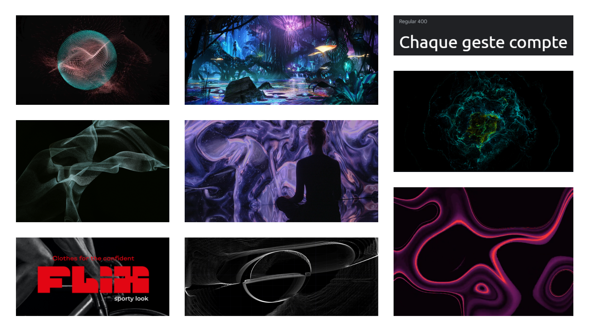
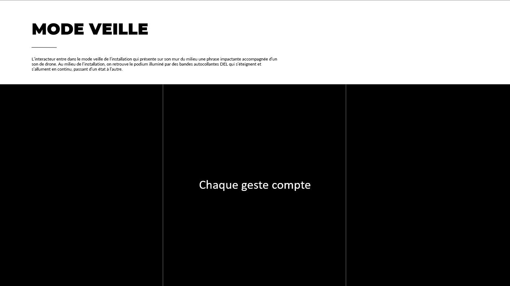
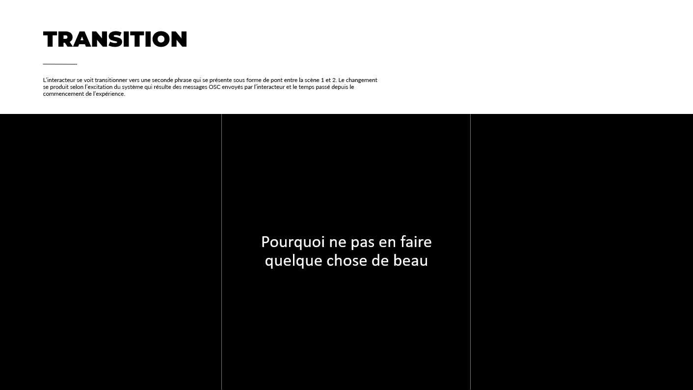
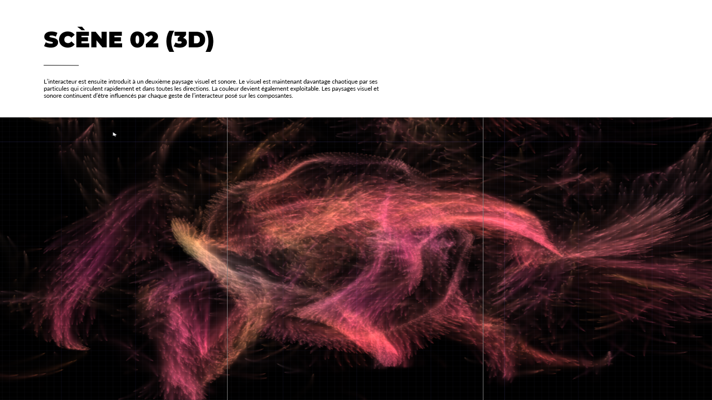
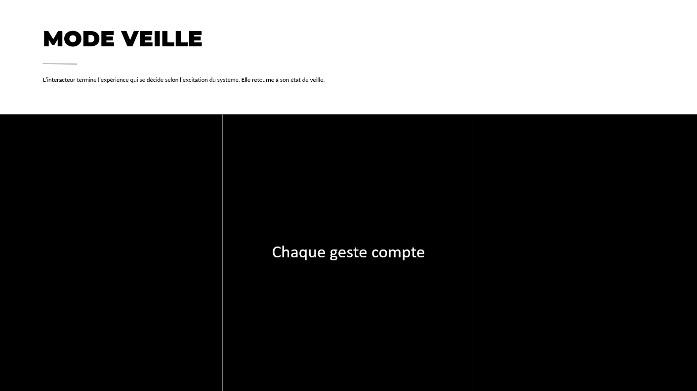
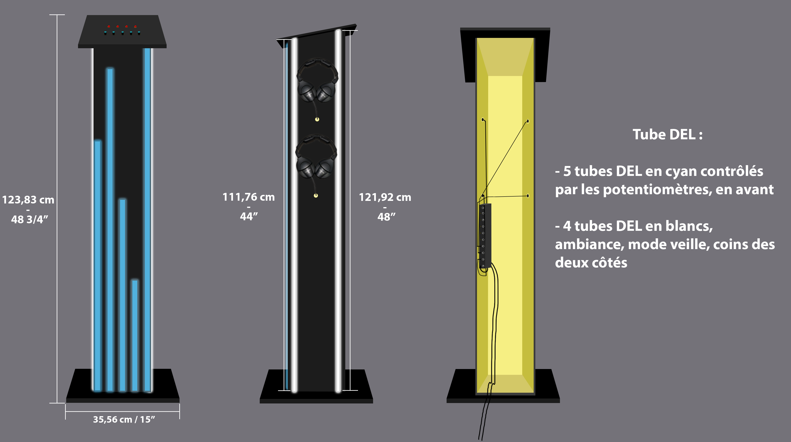
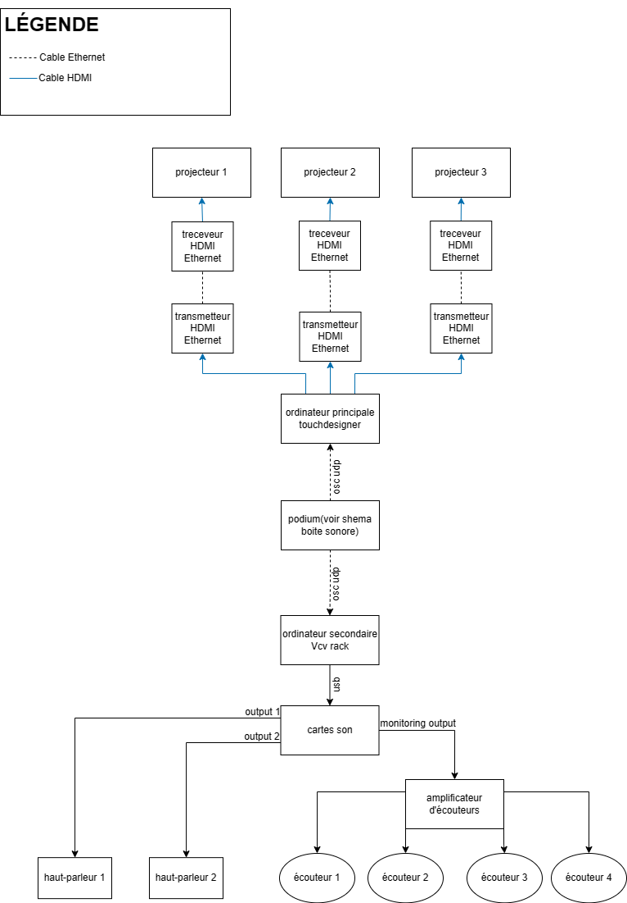
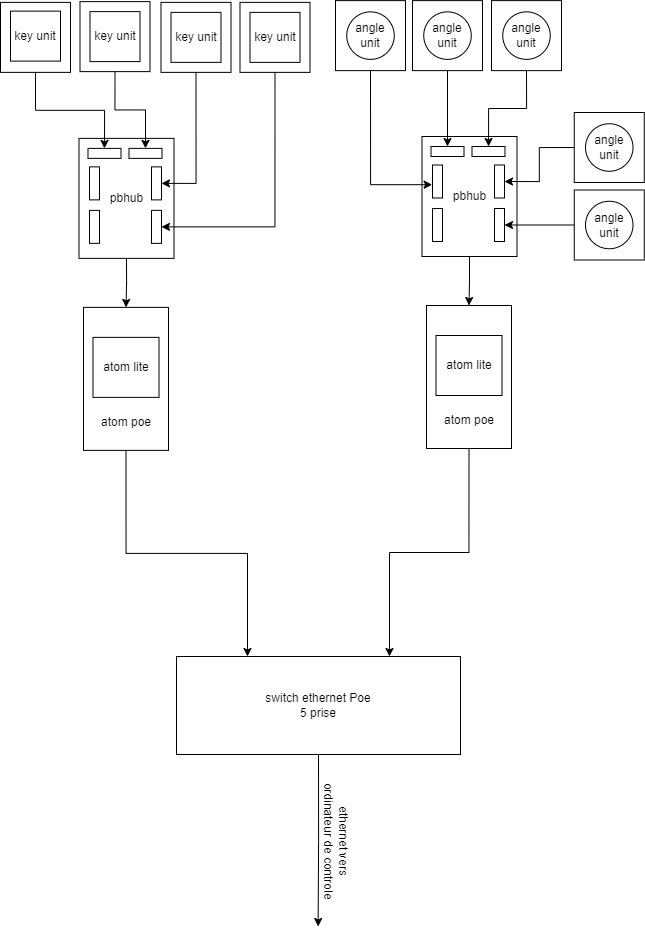
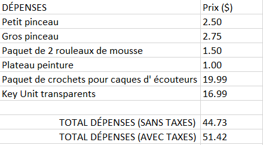

# Préproduction
> C'est ici qu'on dépose les éléments de la préproduction.

# Table des matières
1. [Intention ou concept](#Intention-ou-concept)
    - [Cartographie](#Cartographie)
    - [Intention de départ](#Intention-de-départ)
    - [Synopsis](#Synopsis)
    - [Moodboard visuel](#Moodboard-visuel)
    - [Moodboard sonore](#Moodboard-sonore)
    - [Scénarimage](#Scénarimage)
2. [Contenu multimédia à intégrer](#Contenu-multimédia-à-intégrer)
    - [Inventaire du contenu multimédia](#Inventaire-du-contenu-multimédia)
    - [Univers artistique des éléments](#Univers-artistique-des-éléments-centraux)
3. [Planification technique d'un prototype (devis technique)](#Planification-technique-(devis-technique))
    - [Schémas ou plans techniques](#Schémas-ou-plans-techniques)
    - [Installation](#Installation)
    - [Matériaux requis](#Matériaux-de-scénographie-requis)
    - [Équipements requis](#Équipements-requis)
    - [Rôle des composantes de M5Stack](#Rôle-des-composantes-de-M5Stack)
    - [Logiciels requis](#Logiciels-requis)
    - [Ressources humaines requises](#Ressources-humaines-requises)
    - [Ressources spatiales requises (rangement et locaux)](#Ressources-spatiales-requises-(rangement-et-locaux))
    - [Contraintes techniques et potentiels problèmes de production](#Contraintes-techniques-et-potentiels-problèmes-de-production)
4. [Planification de la production d'un prototype (budget et étapes de réalisation)](#Planification-de-la-production-(budget-et-étapes-de-réalisation))
    - [Budget](#Budget)
    - [Échéancier global](#Échéancier-global)
    - [Liste des tâches à réaliser](#Liste-des-tâches-à-réaliser)
    - [Rôles et responsabilités des membres de l'équipe](#Rôles-et-responsabilités-des-membres-de-l'équipe))
    - [Moments des rencontres d'équipe](#Moments-des-rencontres-d'équipe)
5. [Direction artistique](#Direction-artistique)
    - [Semaine 1](#Semaine-1)
    - [Semaine 2](#Semaine-2)

# Intention ou concept

## Intention de départ
Par ce projet, nous souhaitons pousser l'interacteur à se déchaîner de toutes de forme de contrôle pour laisser place à la création complète d'un monde immersif et interactif qui mène vers une expérience hyperstimulante. De plus, le but de Sonalux est de repenser les idées préconçues d'un studio de musique dans un esthétique d'art génératif qui permet de rendre l'installation accessible pour tout le monde. 

## Synopsis
Sonalux est une expérience qui se distingue par son environnement visuel et sonore évolutif contrôlé par les gestes posés par les interacteurs les amenant vers un tout nouvel univers qui leur est propre. Le public est appelé à découvrir les particularités de l'expérience en explorant les diverses composantes de la boîte ainsi que ses différentes scènes visuelles.

## Moodboard visuel

### Moodboard général
> 

### Exemples de paysages visuels génératifs

> [Generative Art | Particles in TouchDesigner](https://www.youtube.com/watch?v=3snFQtLRJqs&t=2s)

> [Ocean of Particles . Part 1 . TouchDesigner](https://www.youtube.com/watch?v=wdAFCVKLG88)

> [Audio-visual 1](https://www.youtube.com/watch?v=9ehYJY_W-OA)

> [Audio Visual "Particle and Rectangle"](https://www.youtube.com/watch?v=NsVl-C9X_Ho)

> [Audio reactive pseudo Voronoi made with TouchDesigner](https://www.youtube.com/watch?v=TOg9AAa832w)

> [Heavier Than Heaven](https://www.youtube.com/watch?v=NQzKAPyHcTY)

## Moodboard sonore

> [First Cell - Lucy](https://www.youtube.com/watch?v=XCI8FCjZwtg&list=OLAK5uy_lkCzCeDWNnNVo0F90-yia8ZR3UT2cpLFA&index=2)

> [Patch Notes: Hélène Vogelsinger](https://www.youtube.com/watch?v=kYxheEGl2oM)

> [Stranger Things - Theme](https://www.youtube.com/watch?v=2obv0DHuhu4)

> [Mike Dean | Three Jewels](https://www.youtube.com/watch?v=y3QgXLLX_Rs)

> [Aaron Batzdorff - TikTok](https://www.tiktok.com/@aaronbatzdorff/video/7256329924485582122)

## Scénarimage
> 

> 

> 

> 

> 

# Contenu multimédia à intégrer
## Inventaire du contenu multimédia

- 3 paysages visuels génératifs (TouchDesigner)
- 1 paysage sonore (VCV Rack)

# Planification technique d'un prototype (devis technique)
## Schémas ou plans techniques

### Schéma de plantation 
> 

### Schéma du podium
> 

### Schéma de branchement de l'installation
> 
### Schéma de branchement de la boîte sonore
> 

## Installation
L'expérience se déroule entre 3 murs blancs, dont deux qui sont mobiles. Dans les herses, il y a deux hauts-parleurs ainsi que 3 projecteurs accrochés afin de projeter un son génératif et trois projections génératives. Au centre de l'installation se trouve un podium qui sert à contrôler les différents paysages sonores et visuels de l'expérience. Pour ce faire, l'interacteur devra utiliser les composantes M5Stack placées au dessus du podium, c'est-à-dire : Atom Lite, Atom POE, Angle Unit, Key Unit, ToF Unit, PBHub, GroveHub, PaHub. Le podium sera décoré de tubes DEL tout autour qui seront synchronisés avec l'expérience tel que ceux qui seront disposés autour des murs. 

## Matériel de scénographie requis

* 2 murs mobiles

## Équipements requis

* Audio
    * 2 haut-parleurs actifs de 4"
    * 4 fils XLR 3 conducteurs de 15' (M->F)
    * Interface audio USB disposant 8 sorties et au moins 1 entrée
    * 4 casques d'écouteurs
    * Carte de son

* Vidéo
    * 3 projecteurs vidéo lentille grand angle 0.5

* Lumière
    * Tubes DEL

* Électricité
    * 4 cordons IEC (pour l'alimentation des haut-parleurs)
    * 2 extentions 3 fiches et 3 conducteurs 
    * 2 multiprises

* Réseau
    * 4 fils cat6a de 15"
    * Switch POE 5 ports

* Ordinateur
    * 1 ordinateur portable
    * 1 ordinateur sur chariot
 
* M5Stack
    * 3 Atom Lite
    * 3 Atom POE
    * 5 Angle Unit
    * 4 Key Unit
    * 2 ToF Unit
    * 2 PBHub
    * 1 GroveHub
    * 1 PaHub
      
* Autre
    * Podium
    * 4 crochets 

## Rôle des composantes de M5Stack

Angle Unit :
* Mélodie qui change de gamme
* Réverbération 
* Dry\Wet Réverbération 
* Changement de forme d'onde
* Timbre\Harmonie
  
Key Unit (Toggle) :
* Lignes de basses
* Mélodie
* Kick
* Percussion

ToF Unit : 
* Détection de présence
  
## Logiciels requis

* [TouchDesigner](https://derivative.ca/UserGuide/TouchDesigner)
* [VCV Rack](https://vcvrack.com/)
* [Arduino IDE](https://www.arduino.cc/en/software)

## Ressources humaines requises

* TTP, location de matériel
* Professeurs 
  
## Ressources spatiales requises (rangement et locaux)

* Grand studio
    * Rétroprojection vidéo dans le grand studio

## Contraintes techniques et potentiels problèmes de production

| Contrainte ou problème potentiel                                                                                                          | Solution envisagée                                                                                                              
|-------------------------------------------------------------------------------------------------------------------------------------------|-------------------------------------------------------------------------------------------------------|
| Apprendre et maîtriser un tout nouveau logiciel, soit TouchDesigner                                                                       | Expérimentation durant la session |                                                                                                                                                   
| Réaliser le podium et intégrer les différentes composantes, c’est-à-dire analogues (sortie audio) et électriques (microcontrôleurs) | Acheter le matériel nécéssaire |
| Relier les composantes au reste de l’installation                                                                                                | Faire plusieurs itérations de visuel pour que le visuel et le son se complémentent et intéragissent bien ensemble |

# Planification de la production d'un prototype (budget et étapes de réalisation)
## Budget 

## Rôles et responsabilités des membres de l'équipe

**Vincent Desjardins**
- Création du module d'interprétation des données (Kinect)
- Programmation du patch TouchDesigner de génération vidéo
- Création du module sonore génératif et interactif dans VCV Rack
- Installation de l'équipement dans l'espace physique

**Camélie Laprise**
- Coordination technique du projet (coordination de l'échéancier, du budget, suivi de la liste des tâches à réaliser, s'assurer de la répartition du rôle et des responsabilités des membres de l'équipe)
- Création des paysages visuels dans TouchDesigner
- Installation de l'équipement dans l'espace physique
- Organisation du github et du site web

**Ghita Alaoui**
- Création des paysages visuels dans TouchDesigner
- Mapping
- Installation de l'équipement dans l'espace physique
- Organisation du github 

**Antoine Haddad**
- Installation de l'équipement dans l'espace physique
- Coordination des projections/projecteurs
- Création du podium et du boîtier interactif au milieu de l'installation

# Direction artistique 

## Semaine 1

### Nom d'équipe

Miray

### Nom de projet

Sonalux

### Public cible

Explorateur

### Comportement
L’interacteur est amené à découvrir l’expérience en se dirigeant vers le podium situé dans la zone délimitée pour manipuler de manière tactile les diverses composantes mises à sa disposition et ainsi créer sa propre composition sonore et visuelle. 

### Esthétique
L’esthétique d'art génératif des paysages sonores et visuels obligent l’interacteur à se déchaîner, car il n’a aucune référence sur ce qu’il voit et ce qu’il entend. Il découvre un monde sans contraintes inconnu du monde présent.

### Espace
L’installation se présente comme une enceinte afin de mettre l’accent sur l’aspect immersif. De plus, l’espace permet d’accueillir plusieurs utilisateurs afin qu’ils découvrent l'espace virtuel et voyagent ensemble dans celui-ci menant vers une toute nouvelle expérience représentée comme étant un voyage astral. 

### Temps
Le temps se divise en deux dans notre projet, à commencer avec ***chronos*** proposé par l’évolution graduelle vers un monde sans contraintes. Constitué de trois visuels différents, il rappel également à l’utilisateur dans quelle partie de la boucle il se situe, il est objectif. Puis, il y a ***kairos*** qui est subjectif comme l’expérience vécue par les utilisateurs qui est propre à chacun. Lorsque l'interacteur quitte, le projet revient à l'état de veille comme lorsqu'il rentre, il en sort. Sonalux forme une boucle.

### Quelles émotions voulez-vous faire vivre à l’interacteur ?

* Euphorie sensorielle
* Hyperstimulation

### Pourquoi ?
Nous souhaitons pousser l'intéracteur à se déchaîner de toutes formes de contrôle pour laisser place à la création complète d'un monde immersif et interactif.

### Quelles questions votre projet met-il dans l’esprit de l’interacteur ?

* S’abandonner à quelque chose de nouveau est-il bénéfique pour soi-même ?
* Est-ce que je peux parvenir à créer quelque chose par moi-même ?
* Est-ce que la nouveauté est une chose effrayante ?
* Est-ce un bon moyen de sortir de sa zone de confort ?

### Que devrez-vous faire pour qu’il ait envie de réponde à ces questions ?
Proposer une expérience nouvelle dont le public cherche à découvrir et leur permettant de s’amuser sans penser et sans réfléchir aux répercussions de leurs gestes les poussant davantage vers une créativité qui leur est unique. 

## Semaine 2

### Tous les verbes disponibles à vos interacteurs. 
* Peser
* Tourner
* Enfiler

### Tous les objets sur lesquels chaque verbe peut agir et comment ils le font ?
* L'interacteur pourra peser sur les Key Unit
* L'interacteur pourra tourner les potentiomètres 
* L'interacteur pourra enfiler les casques d'écouteurs

### Plusieurs actions émergentes que vous aimeriez que vos interacteurs effectuent.
* Transitionner de l'introduction à l'expérience
* Modification de la projection
* Modification du son pour créer ses propres arrangements
* Vivre un moment de partage de curiosité et de créativité avec un autre interacteur

### Toutes les façons que les interacteurs peuvent faire progresser l'expérience.
* Expérimenter les différentes composantes associées à la boîte sonore

## Résumé du projet
Sonalux est une installation qui dépasse les limites du réel pour proposer un monde d'art génératif où la notion du temps est repensé dans une boucle laissant place à un voyage astral collectif. L'interacteur se voit projeter dans un espace sans contraintes où il en devient le maître par la maîtrise des pièces d'instruments qui se trouvent sur le podium. 
